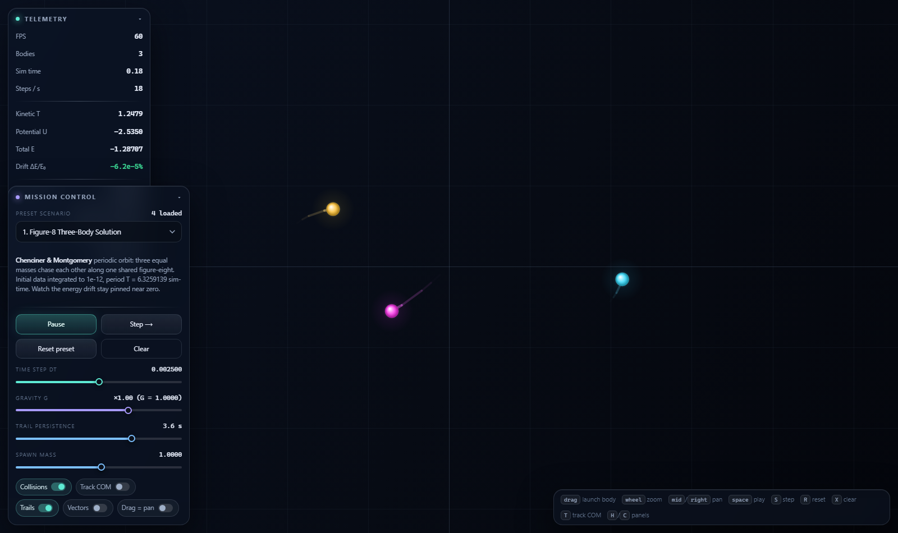

# Gravitational N-Body & Orbital Mechanics Laboratory

A single self-contained HTML file — no dependencies, no build, no network. Written end to end by
**Qwen3.8-Flash-Next running locally** on one 16 GB consumer GPU.

**▶ [Open the lab](https://lokensi.github.io/qwen3.8-flash-next-local/)**



## What it does

Plummer-softened Newtonian gravity integrated with **velocity Verlet** (symplectic), so the
displayed Hamiltonian `H = T + U` stays nearly conserved — the HUD shows live energy drift
`ΔE/E₀` as an honesty check on the integrator.

Four preset scenarios:

1. **Figure-8 Three-Body Solution** — the Chenciner & Montgomery periodic orbit, initial data to
   1e-12, period `T = 6.3259139`.
2. **Sun–Earth–Moon System** — real units (AU, years, solar masses, `G = 4π²`); the Moon stays
   captured inside Earth's Hill sphere.
3. **Lagrange Points Demonstration** — test particles parked at L4 / L5.
4. **Galaxy Collision / Accretion Core** — two dense clusters on hyperbolic approach.

Plus fading trails, force vectors, centre-of-mass tracking, inelastic collisions that merge bodies
conserving mass and momentum, and live sliders for timestep `dt`, gravitational constant `G`,
trail persistence and spawn mass.

## Controls

| Input | Action |
|---|---|
| drag | launch a new body (drag length sets velocity) |
| wheel | zoom |
| middle / right drag | pan |
| `space` | play / pause |
| `S` | single step |
| `R` | reset preset |
| `X` | clear all bodies |
| `T` | track centre of mass |
| `F` | fit view |
| `H` / `C` | toggle telemetry / controls panels |

## The machine that wrote it

| | |
|---|---|
| **Model** | Qwen3.8-Flash-Next — Unsloth `UD-IQ3_XXS` (~3.06 bpw, 176.9 B params MoE, 77 GiB on disk) |
| **Runtime** | [GenerelSchwerz/llama.cpp](https://github.com/GenerelSchwerz/llama.cpp) `moe-cache` branch @ [`b46f7f7a4`](https://github.com/GenerelSchwerz/llama.cpp/commit/b46f7f7a436f990932d3da3ec53380e2b9effc89), CUDA 13.3.1, in Docker |
| **GPU** | NVIDIA RTX 5070 Ti — 16 GB |
| **CPU / RAM** | Intel i7-14700F (20C / 28T) — 64 GB |
| **Host** | Windows 11 → WSL2 (Ubuntu 24.04) → Docker Desktop |
| **Context** | 262,144 tokens, KV cache `q8_0` |

A 77 GiB model on a 16 GB card works because `--load-mode none --lazy-mode on` keeps the MoE
expert table file-backed on SSD and streams experts on demand into a pinned host cache, instead
of loading the whole thing into RAM.

Measured on this box, 1024-token completions:

| context | prefill | decode | VRAM peak |
|---|---|---|---|
| 12 k | 123 tok/s | 43 tok/s | 15.4 / 16.3 GB |
| 64 k prompt @ 262 k ctx | 185 tok/s | 19 tok/s | 15.1 / 16.3 GB |

Host `MemAvailable` bottomed out around 9.5 GB.

## How it was driven

Cline in VS Code, pointed at the container's OpenAI-compatible endpoint:

```
http://127.0.0.1:24625/v1     model: early-router-flash
--jinja --reasoning-format deepseek
--temp 1.0 --top-p 0.95 --top-k 20 --min-p 0     # Qwen's thinking-mode recommendation
```

Reasoning arrives separately in `reasoning_content`. The model's chat template defaults
`reasoning_effort` to `xhigh`, so give it real headroom — a small `--reasoning-budget` truncates
it mid-thought on agent-scale tasks.

## Reproduce it

<details>
<summary>The exact prompt that produced this file</summary>

````text
Create a complete, single-file HTML5/CSS/JavaScript web application called "Gravitational N-Body & Orbital Mechanics Laboratory".

The file must run standalone by opening it directly in any modern web browser without build steps, external npm packages, or server runtimes. You may use Tailwind CSS via CDN or write clean modern vanilla CSS.

### 1. Physics Engine Requirements
- Implement stable orbital simulation using Symplectic Verlet or Velocity Verlet integration (do not use simple Euler integration, as orbits will quickly destabilize).
- Include a gravitational softening factor (epsilon) to prevent numerical division-by-zero singularities when bodies get close.
- Support inelastic collisions: when two bodies collide based on their radii, they merge into a single body conserving mass, volume (radius scales with cube root of mass), and momentum.
- Compute and display real-time Hamiltonian system energy: Kinetic Energy (T), Gravitational Potential Energy (U), and Total Energy (E = T + U) to demonstrate numerical energy conservation drift.

### 2. Built-in Presets
Provide a dropdown selector with instant initialization for:
1. "Figure-8 Three-Body Solution": The classic Chenciner & Montgomery stable 3-body periodic orbit.
2. "Sun-Earth-Moon System": Hierarchical orbit demonstrating stable lunar orbital capture.
3. "Lagrange Points Demonstration": A massive central body, a secondary orbiting body, and low-mass test particles at L4 and L5 showing orbital stability.
4. "Galaxy Collision / Accretion Core": Two dense star clusters in approaching hyperbolic trajectories with orbiting test debris.

### 3. Canvas & Visual Rendering
- Full-viewport HTML5 Canvas handling dynamic window resizing and sharp rendering on high-DPI/Retina screens (`window.devicePixelRatio`).
- Fading motion trails: render orbital path histories with decaying opacity.
- Particle appearance: bodies rendered with radiant glow effects (e.g., radial gradients or `globalCompositeOperation = 'screen'`) scaled by mass/density.
- Velocity vector arrows drawn while dragging to spawn new bodies.

### 4. Interactivity & Camera Controls
- Click-and-drag creation: clicking anywhere spawns a new mass; dragging draws an initial velocity vector arrow; releasing launches the body.
- Camera controls: smooth mouse-wheel zooming and middle/right-click panning. Add a toggle for "Track Center of Mass".
- Control Panel:
  - Play / Pause and Step Forward buttons.
  - Time-step slider (dt) and Gravitational constant slider (G).
  - Trail persistence slider (fade duration).
  - Collision on/off toggle.
  - Clear canvas / Reset current preset buttons.
- Real-time HUD: display current FPS, active body count, total system momentum, and energy conservation error rate (% delta from t=0).

### 5. UI/UX Aesthetic
- Sleek dark theme (slate/charcoal background) with a floating glassmorphic control dock (frosted glass blur, subtle borders).
- Collapsible HUD / controls panel so the canvas can be viewed unobstructed.
- Clean typography and polished slider/button states (hover and active feedback).

### 6. Deliverable Constraints
- Output ONLY valid, executable HTML inside a single ```html code block.
- Do NOT use placeholders, TODOs, or truncate code with comments like `// implement physics here`.
- Ensure zero console errors on startup and on all preset transitions.
````

</details>

The model chose vanilla CSS over the offered Tailwind CDN, which is why the result is genuinely
offline-capable.
